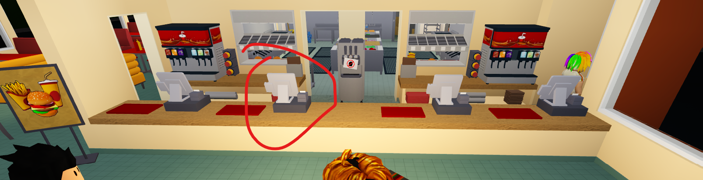

- What is AutoServe?
    AutoServe is a Python bot designed to automate the fast food worker job in the Roblox game "Welcome to Bloxburg."

- How does it work?
    AutoServe uses an open-source Python library called OpenCV for image detection. It detects items on the screen and NPC orders to automate the tasks.

- How do I use it?
    1. Obtain the executable or build from source.

    2. Load into the game and start your shift.

    3. Run the program and wait for it to load.

    4. Once it has finished loading, go to this specific cash register for the best performance of the bot.
    

    5. Let the bot run!

    6. Once you've got the cash, just press "q" on your keyboard and stop the bot. Simple!

- NOTE
    For those who believe this is cheating, it is not. This process only automates a task. Additionally, you will still need to manually refill your stats when they decrease and will also make the same amount of money as a human.